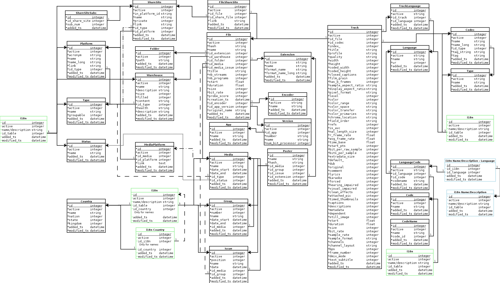

[//]: # ( -*- coding: utf-8 -*- )
[//]: # ( ---------------------------------------------------------------------- )
[//]: # (+ Autor:  	Ran# )
[//]: # (+ Creado: 	2023/02/12 15:28:31.773700 )
[//]: # (+ Editado:	2023/02/13 20:44:58.024226 )
[//]: # ( ---------------------------------------------------------------------- )

# Documentation

## Index

- [Diagrams](#diagrams)
- [Tables](tables.md#tables)

## Diagrams

Both diagrams are presented in its simplified version since the adding of all entities and tables for the internacionalization of text would make the diagram very difficult to be understood.

### Entity Relationship

The green "i18n" bubble indicates the existance of entities for each translatable element of the original entity.
e.g.: In "WarehouseType", which has "name" and "description" both would be used creating "WarehouseTypeName" and "WarehouseTypeDescription".
"Warehouse" or "Platform", on the other hand, would only use the "description" attribute since the "name" one would not make sense (its a personal name and not a common one).

The bubble in "Language" has an arrow in each direction towards "i18n" because, appart from having a normal relationship like the one explained before, all "i18n" tables have a relationship to the "Language" table (indicating which language the text is in).

Finally, the "Country" table also has a somewhat special relationship.
The diagram tries to convey how the of all three medias tables names can be country specific (e.g.: a title given to a film in a specific country).

### Relational Model

The green "i18n" table represents the existance of translation tables for attributes like "name" and/or "description".
On the right side, on a blue tone, the same "i18n" table is presented with the structure all translation tables will emulate by having another table that uses the translation table id and the language id to tie it all together.
