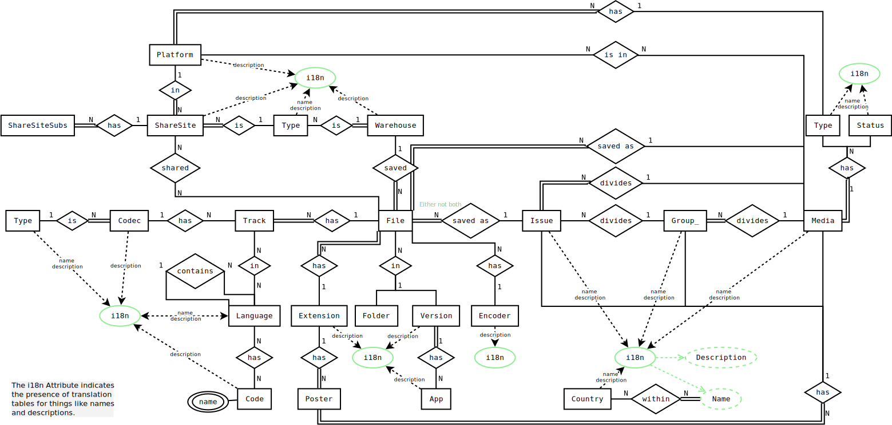

[//]: # ( -*- coding: utf-8 -*- )
[//]: # ( ---------------------------------------------------------------------- )
[//]: # (+ Autor:  	Ran# )
[//]: # (+ Creado: 	2023/02/12 15:28:31.773700 )
[//]: # (+ Editado:	2023/02/13 20:27:14.394383 )
[//]: # ( ---------------------------------------------------------------------- )

# Documentation

## Index

- [Tables](tables.md#tables)

## Diagrams

### Entity Relationship

### Relational Model

